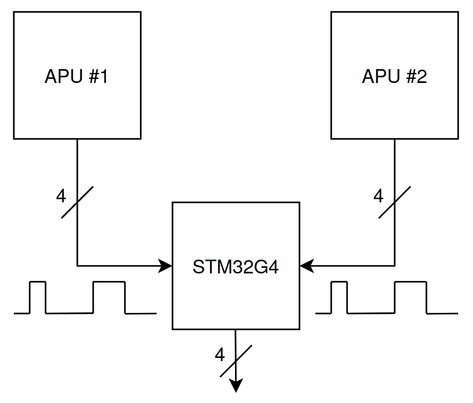
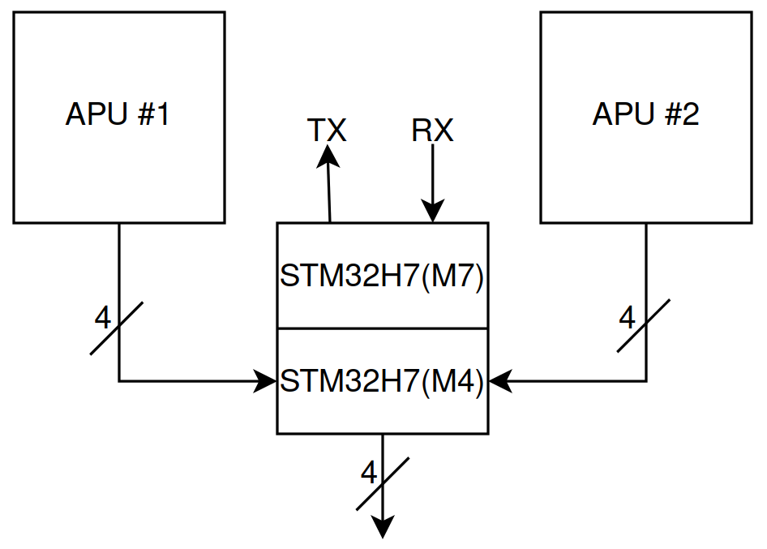
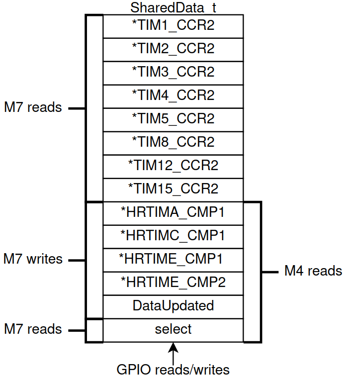
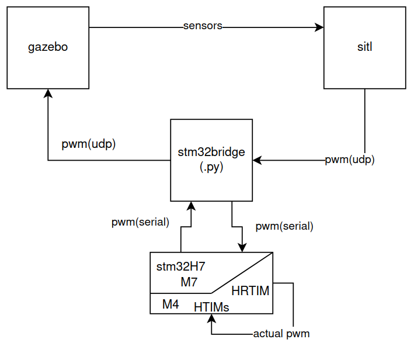
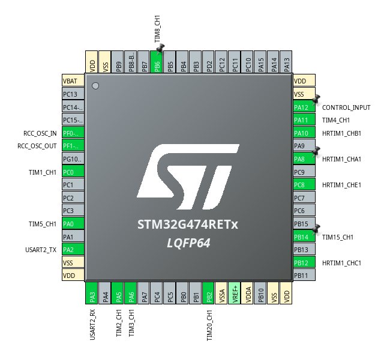
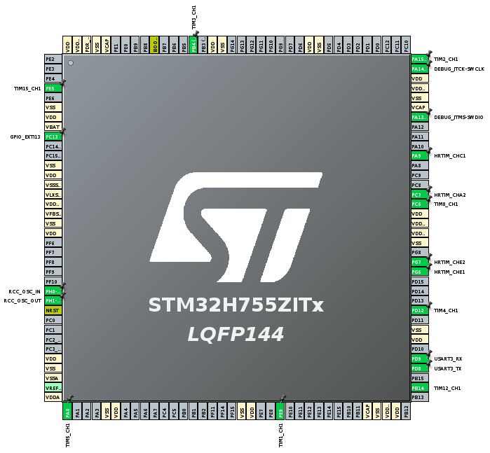

# APU-MUX: Multiplexer System for UAV Autopilots

This repository contains the research, source code, and validation steps for a UAV Autopilot Multiplexer System. The project aims to create a redundancy mechanism that switches control between two Autopilot Units (APU) to a single set of actuators, enhancing the safety of Unmanned Aerial Vehicles (UAVs).

## 📖 Project Overview

The core function of this system is to act as a "coordinator" between two redundant autopilots. It operates with zero intelligence regarding flight dynamics, focusing solely on signal integrity and switching reliability.

Key Responsibilities:

    Sample Input: Capture PWM signals from APU #1 and APU #2.

    Reproduce Output: Generate a PWM signal for the actuators based on the selected input.

    Switching Logic: Select which APU controls the drone via a switching mechanism (GPIO trigger).

## 🛠 Hardware Architecture

The research was conducted in two phases using STMicroelectronics development boards.
### Phase 1: STM32G4 (Nucleo-G474RE)

Used for initial exploration of PWM input sampling and High-Resolution Timer (HRTIM) output.

    Input: 8 Timers (HTIMs) used in PWM Input mode to capture Period and Duty Cycle.

    Output: 4 High-Resolution Timers (HRTIMs).

    Limitation: The HRTIM hardware on the G4 requires a minimum system clock of 100MHz. This results in a minimum output PWM frequency of ~1526Hz, which is incompatible with standard 50Hz ESCs/Servos.

### Phase 2: STM32H7 (Dual Core M7 + M4)

The final implementation utilizes the STM32H755ZI (Nucleo-144) to overcome frequency limitations and introduce redundancy logic.

    M4 Core: Dedicated to "hard real-time" tasks: PWM sampling and forwarding.

    M7 Core: Handles "intelligent" tasks and serial communication.

    Clock Configuration: System clock set to 80MHz with timer clocks at 2.5MHz to support standard 50Hz PWM output.

## 💻 Software Implementation Strategy

This repository includes code for three distinct implementation approaches:
1. NVIC (Interrupt-Based)

    Mechanism: Uses global interrupts on input timers to capture PWM data.

    Pros: Simple implementation using HAL libraries.

    Cons: High CPU overhead. Performance degrades at high frequencies due to interrupt overload.

2. DMA (Direct Memory Access)

    Mechanism: Offloads CPU by transferring captured data directly from Input Timer registers to Output Timer registers.

    Memory Mapping: Exploits the memory layout of the STM32 peripherals. Since G4 registers have different bit-widths (16-bit reads vs 32-bit writes), the DMA handles the transfer to achieve autonomous updates.

    Performance: Works perfectly up to 30KHz input frequency with minimal CPU intervention.

3. Dual-Core Setup (STM32H7)

    Architecture:

        Shared Memory: Used to pass data between the M7 and M4 cores.

        Synchronization: Hardware Semaphores (HSEM) synchronize boot sequences and resource access.

    

## 🧪 Verification: Hardware-in-the-Loop (HITL)

To verify the hardware without risking a physical drone, a HITL environment was created using ArduPilot SITL and Gazebo.

Data Flow:

    Gazebo: Simulates physics and sends sensor data to SITL.

    ArduPilot SITL: Calculates motor outputs and sends them via UDP.

    stm32bridge.py: A Python script that acts as a bridge. It converts UDP packets to Serial data.

    STM32H7: Receives Serial data (M7), generates electrical PWM (M4), samples it back, and returns the read values to the script .

To run the verification experiment, refer to the scripts in the coordinator.py and stm32bridge.py files.
## 🔌 Pinout Configuration

### STM32G474RET

### STM32H755ZIT

Note: The system supports 8 inputs mapped to 4 high-resolution outputs.
## 📂 Repository Structure

    imgs/: Images used for this README.

    manuals/: pdf files for the STM32G4's and H7's documentation.

    src/: STM32CubeIDE projects of G4 and H7.

    scripts/: Contains the dma_script.py, nvic_script.py for the G4 and stm32bridge.py for testing H7 and HITL.

    board/: Contains a custom pcb implementation.

## ⚙️ Prerequisites

    IDE: STM32CubeIDE.

    Flash Tool: STM32CubeProgrammer.

    Simulation: ArduPilot SITL, Gazebo 8.10.

    Python Libraries: PyVISA, Serial libraries.

    ArduPilot: https://github.com/ArduPilot/ardupilot.git

    Gazebo 8.10: https://github.com/gazebosim 

    SITL_Gazebo plugin: https://github.com/ArduPilot/ardupilot_gazebo.git

## 📝 Credits

Author: Christos Karagiannis

Institution: University of Thessaly, Department of Electrical and Computer Engineering.